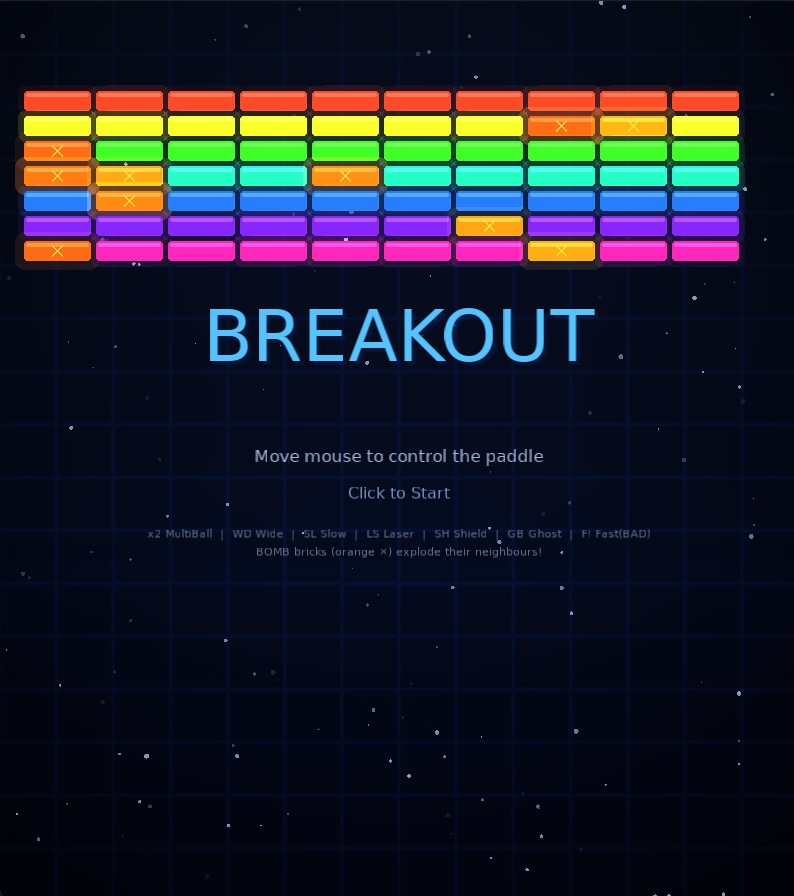
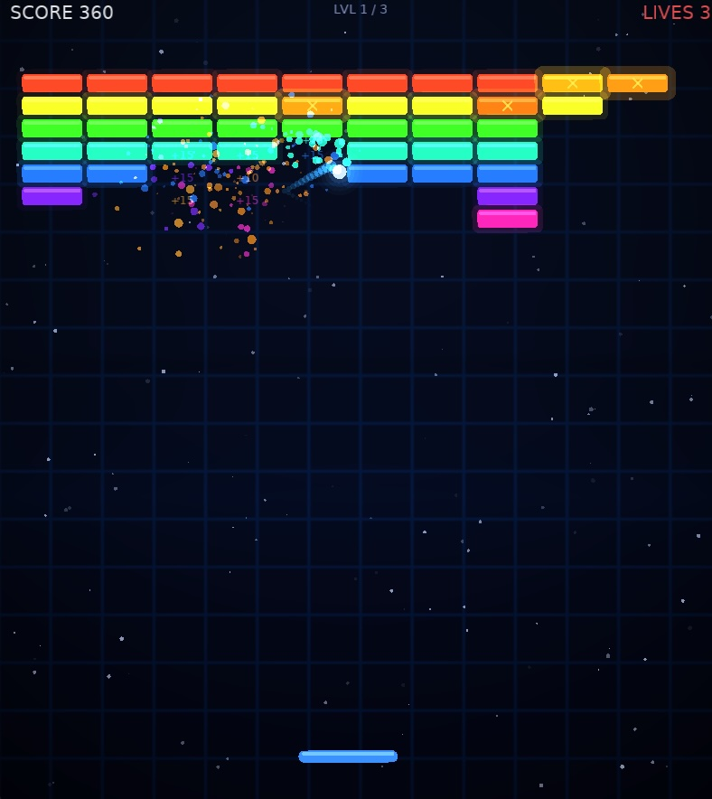
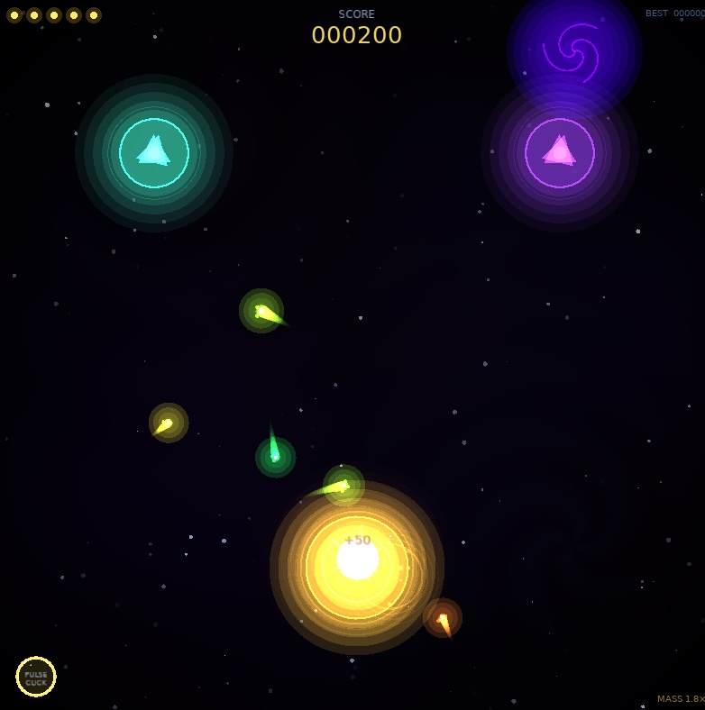
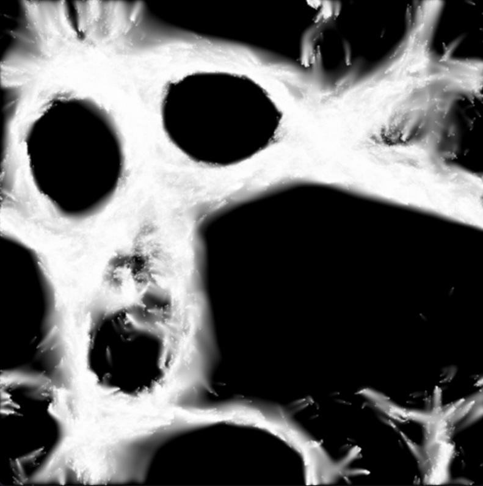
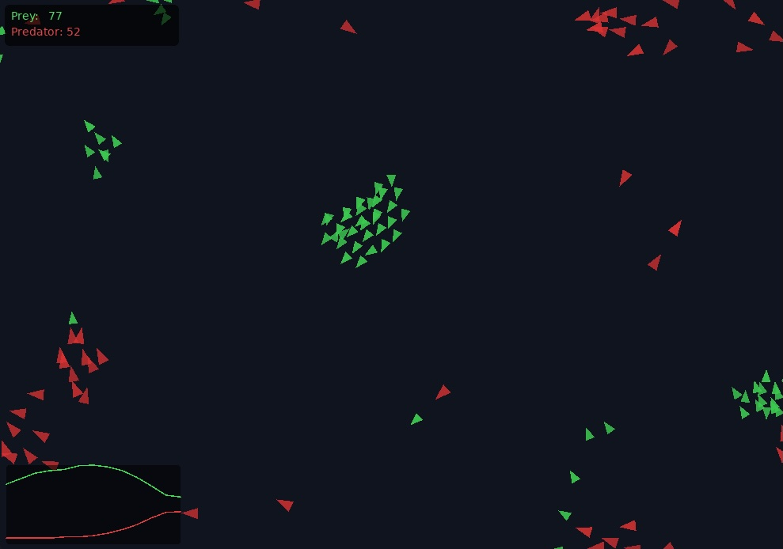
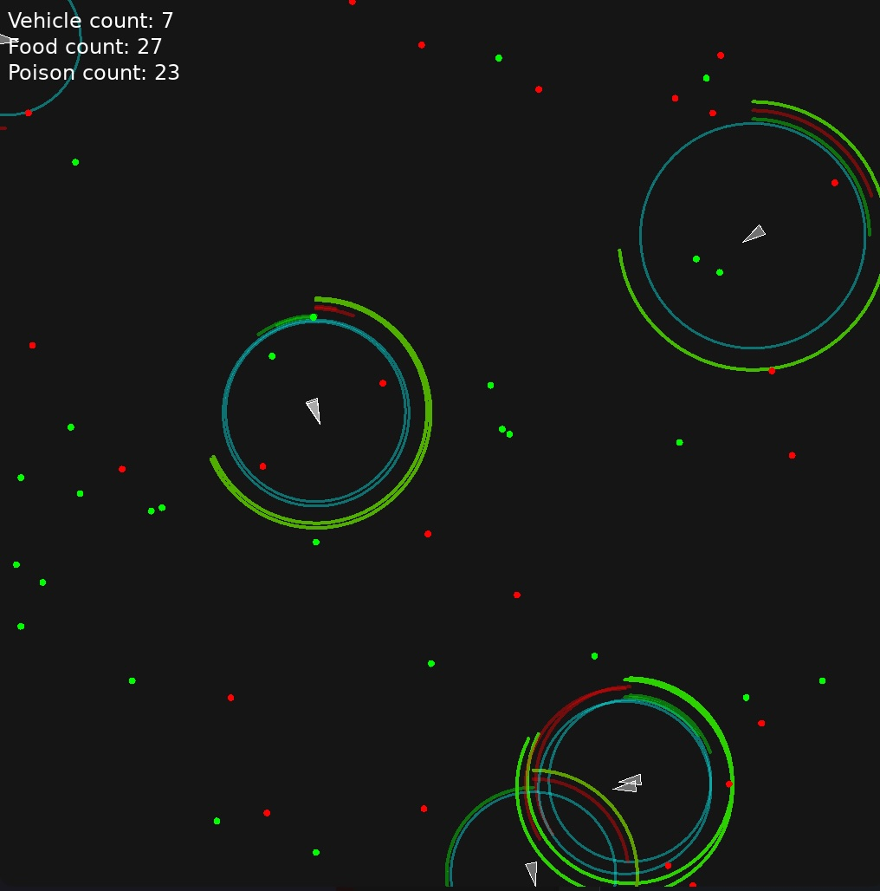

# p5cpp


[](https://GitHub.com/FelixCpp/p5cpp/graphs/commit-activity)
[](https://github.com/FelixCpp/p5cpp/blob/main/LICENSE.txt)

A C++ creative coding framework inspired by [Processing](https://processing.org/) and [p5.js](https://p5js.org/). If you've drawn circles with `ellipse()` or built particle systems in a JavaScript `draw()` loop, p5cpp will feel immediately familiar — just with the full power of native C++ underneath.

---

## Credits

p5cpp is built on the ideas and API design of two great creative coding environments:

- **[Processing](https://processing.org/)** — the original, created by Casey Reas and Ben Fry. A flexible software sketchbook and language for learning how to code within the context of the visual arts.
- **[p5.js](https://p5js.org/)** — a JavaScript library created by Lauren McCarthy that interprets Processing's core philosophy for the web.

p5cpp is not affiliated with or endorsed by either project. It is a spiritual port of their ideas into native C++, intended for cases where performance, low-level GPU access, or platform constraints make a native runtime preferable.

---

## Dependencies

p5cpp bundles the following third-party libraries under the `third_party/` directory. You do not need to install them separately — they are compiled as part of the build.

| Library                                           | Purpose                                                                                                                         |
| ------------------------------------------------- | ------------------------------------------------------------------------------------------------------------------------------- |
| [FreeType](https://freetype.org/)                 | Font loading and glyph rasterisation — backs `loadFont()`, `getGlyph()`, and all text rendering                                 |
| [GLAD](https://glad.dav1d.de/)                    | OpenGL function loader — resolves GL function pointers at runtime on all platforms                                              |
| [GLFW](https://www.glfw.org/)                     | Window creation, OpenGL context management, and raw input events (mouse, keyboard, resize)                                      |
| [libtess2](https://github.com/memononen/libtess2) | Polygon tessellation — used internally to triangulate concave and self-intersecting shapes drawn with `beginShape` / `endShape` |

## Screenshots of [examples](./examples/)

<p align="middle">
    
    
    
    
    
    
</p>

## Concepts

Every p5cpp program is a **Sketch**. You subclass `p5cpp::Sketch`, implement `setup()` (called once) and `draw()` (called every frame), and hand it to the framework via `createSketch()`. The framework manages the window, the render loop, and input — you just draw.

```cpp
#include <p5cpp/p5cpp.h>

struct MySketch : p5cpp::Sketch
{
    void setup() override
    {
        setWindowSize(800, 600);
        setWindowTitle("Hello p5cpp");
        frameRate(60);
    }

    void draw() override
    {
        background(30);
        fill(255, 100, 0);
        noStroke();
        circle(getMouseX(), getMouseY(), 40);
    }
};

std::unique_ptr<p5cpp::Sketch> p5cpp::createSketch()
{
    return std::make_unique<MySketch>();
}
```

---

## Examples

### 1. Basic Shapes

```cpp
void draw() override
{
    background(240);

    // Filled rectangle
    fill(70, 130, 200);
    stroke(20, 60, 120);
    strokeWeight(2.0f);
    rect(50, 50, 200, 100);

    // Rounded rectangle (uniform corner radius)
    fill(200, 80, 80);
    noStroke();
    rect(300, 50, 100, 100, 16, 16);

    // Circle and ellipse
    fill(80, 180, 80);
    stroke(20, 100, 20);
    strokeWeight(1.5f);
    circle(150, 250, 80);
    ellipse(350, 250, 120, 60);

    // Triangle
    fill(200, 160, 40);
    triangle(500, 300, 560, 200, 620, 300);

    // Line
    stroke(0);
    strokeWeight(3.0f);
    line(50, 350, 750, 350);
}
```

---

### 2. Arcs

```cpp
void draw() override
{
    background(20);
    noFill();
    stroke(255);
    strokeWeight(4.0f);

    // Open arc
    arc(200, 200, 150, 150, 0.0f, p5cpp::radians(270), p5cpp::ArcMode::open);

    // Pie slice
    fill(255, 80, 80, 180);
    stroke(255, 80, 80);
    arc(500, 200, 150, 150, p5cpp::radians(-30), p5cpp::radians(120), p5cpp::ArcMode::pie);
}
```

---

### 3. Colours

```cpp
// Named RGBA construction
p5cpp::color_t orange = p5cpp::rgba(255, 140, 0);
p5cpp::color_t semiBlue = p5cpp::rgba(30, 100, 220, 180);

// Derive colours
p5cpp::color_t lighter = p5cpp::lighten(orange, 0.3f);
p5cpp::color_t darker  = p5cpp::darken(orange, 0.4f);
p5cpp::color_t faded   = p5cpp::withAlpha(orange, 80);

// Interpolate between two colours
float t = std::sin(p5cpp::getGlobalTime()) * 0.5f + 0.5f;
p5cpp::color_t blended = p5cpp::lerp(semiBlue, orange, t);

void draw() override
{
    background(20);
    fill(blended);
    noStroke();
    circle(400, 300, 200);
}
```

---

### 4. Transforms

```cpp
void draw() override
{
    background(30);
    fill(255, 200, 50);
    noStroke();

    // Translate to the centre, rotate over time, draw a square
    pushMatrix();
        translate(getWidth() / 2.0f, getHeight() / 2.0f);
        rotate(getGlobalTime());
        rect(-40, -40, 80, 80);
    popMatrix();

    // Scale a second shape independently
    pushMatrix();
        translate(150, 150);
        float s = 1.0f + 0.5f * std::sin(getGlobalTime() * 2.0f);
        scale(s, s);
        circle(0, 0, 60);
    popMatrix();
}
```

---

### 5. Mouse & Keyboard Input

```cpp
struct InputSketch : p5cpp::Sketch
{
    bool drawCircle = true;

    void setup() override { setWindowSize(800, 600); }

    void draw() override
    {
        background(40);
        if (drawCircle)
        {
            fill(100, 200, 255);
            noStroke();
            circle(getMouseX(), getMouseY(), 60);
        }
    }

    void event(const p5cpp::WindowEvent& e) override
    {
        if (e.type == p5cpp::EventType::keyPress)
        {
            if (e.keyEvent.key == p5cpp::Key::space)
                drawCircle = !drawCircle;

            if (e.keyEvent.key == p5cpp::Key::escape)
                quit();
        }

        if (e.type == p5cpp::EventType::mousePress &&
            e.mouseButton.button == p5cpp::MouseButton::left)
        {
            // do something on left click
        }
    }
};
```

---

### 6. Custom Shapes with `beginShape` / `endShape`

```cpp
void draw() override
{
    background(20);
    fill(180, 80, 220);
    stroke(255);
    strokeWeight(2.0f);

    // A hexagon built from vertices
    beginShape();
    for (int i = 0; i < 6; ++i)
    {
        float angle = p5cpp::radians(60.0f * i - 30.0f);
        vertex(400 + std::cos(angle) * 100,
               300 + std::sin(angle) * 100);
    }
    endShape(p5cpp::ShapeType::polygon);
}
```

---

### 7. Bézier & Catmull-Rom Curves

```cpp
void draw() override
{
    background(15);
    noFill();
    stroke(255, 180, 0);
    strokeWeight(3.0f);

    // Cubic Bézier (anchor, control, control, anchor)
    bezier(100, 400, 150, 100, 550, 100, 600, 400);

    // Catmull-Rom curve (ghost point, p1, p2, ghost point)
    stroke(80, 200, 255);
    curve(50, 300, 200, 200, 500, 350, 700, 250);
}
```

---

### 8. Textures & Images

```cpp
struct TextureSketch : p5cpp::Sketch
{
    std::unique_ptr<p5cpp::Texture> tex;

    void setup() override
    {
        tex = p5cpp::loadTexture("assets/photo.png");
        setWindowSize(800, 600);
    }

    void draw() override
    {
        background(0);

        // Draw at original size
        auto [w, h] = tex->getSize();
        image(tex->getRendererId(), 0, 0, (float)w, (float)h);

        // Tinted copy
        tint(255, 100, 100, 200);
        image(tex->getRendererId(), 400, 0, (float)w * 0.5f, (float)h * 0.5f);
        noTint();
    }
};
```

---

### 9. Render to a Framebuffer

```cpp
struct FBOSketch : p5cpp::Sketch
{
    std::shared_ptr<p5cpp::Framebuffer> canvas;

    void setup() override
    {
        canvas = p5cpp::createFramebuffer(512, 512);
        setWindowSize(800, 600);
    }

    void draw() override
    {
        // Draw into the offscreen canvas
        pushCanvas(canvas);
            background(10, 40, 80);
            fill(255, 200, 50);
            noStroke();
            circle(256, 256, 200);
        popCanvas();

        // Display the canvas texture on screen
        background(30);
        image(canvas->getTextureId(), 144, 50, 512, 512);
    }
};
```

---

### 10. Custom GLSL Shaders

```cpp
const char* vert = R"(
    #version 330 core
    layout(location = 0) in vec2 aPos;
    uniform mat4 uMVP;
    void main() { gl_Position = uMVP * vec4(aPos, 0.0, 1.0); }
)";

const char* frag = R"(
    #version 330 core
    uniform float uTime;
    out vec4 FragColor;
    void main()
    {
        float r = 0.5 + 0.5 * sin(uTime);
        FragColor = vec4(r, 0.4, 1.0 - r, 1.0);
    }
)";

struct ShaderSketch : p5cpp::Sketch
{
    std::shared_ptr<p5cpp::Shader> sh;

    void setup() override
    {
        sh = p5cpp::loadShader(vert, frag);
        setWindowSize(800, 600);
    }

    void draw() override
    {
        background(0);
        shader(sh);
        setUniform("uTime", p5cpp::uniform(getGlobalTime()));
        rect(100, 100, 600, 400);
        noShader();
    }
};
```

---

### 11. Text & Fonts

```cpp
struct TextSketch : p5cpp::Sketch
{
    std::unique_ptr<p5cpp::Font> font;

    void setup() override
    {
        font = p5cpp::loadFont("assets/Inter-Regular.ttf");
        textFont(std::shared_ptr<p5cpp::Font>(font.get(), [](auto*){}));
        textSize(32);
        setWindowSize(800, 600);
    }

    void draw() override
    {
        background(20);

        // Centred headline
        fill(255);
        textAlign(p5cpp::TextAlign::center);
        text("Hello, p5cpp!", getWidth() / 2.0f, 80);

        // Left-aligned body text with wrapping
        fill(180);
        textSize(16);
        textAlign(p5cpp::TextAlign::topLeft);
        textWrap(p5cpp::TextWrap::word);
        text("This text will wrap at 400 px.", 50, 150, 400.0f);
    }
};
```

---

### 12. Particle System

A minimal particle system demonstrating `float2` maths, `randomFloat`, `noise`, and delta-time based movement:

```cpp
struct Particle
{
    p5cpp::float2 pos;
    p5cpp::float2 vel;
    float life; // 0..1
};

struct ParticleSketch : p5cpp::Sketch
{
    std::vector<Particle> particles;

    void setup() override
    {
        p5cpp::randomSeed(42);
        setWindowSize(800, 600);
        frameRate(60);
    }

    void draw() override
    {
        background(10, 10, 10, 30); // alpha trail

        const float dt = getDeltaTime();

        // Spawn
        for (int i = 0; i < 5; ++i)
        {
            p5cpp::float2 dir = p5cpp::randomDirection<float>();
            particles.push_back({
                {(float)getWidth() / 2, (float)getHeight() / 2},
                dir * p5cpp::randomFloat(50.0f, 150.0f),
                1.0f
            });
        }

        // Update & draw
        noStroke();
        for (auto& p : particles)
        {
            p.pos += p.vel * dt;
            p.life -= dt * 0.5f;

            int alpha = (int)(p.life * 255);
            fill(200, 120, 255, alpha);
            circle(p.pos.x, p.pos.y, 6);
        }

        // Remove dead
        std::erase_if(particles, [](const Particle& p){ return p.life <= 0.0f; });
    }
};
```

---

### 13. Perlin Noise Flow Field

```cpp
void draw() override
{
    background(10);
    stroke(255, 255, 255, 40);
    strokeWeight(1.0f);
    noFill();

    float t = getGlobalTime() * 0.3f;

    for (int x = 0; x < getWidth(); x += 20)
    {
        for (int y = 0; y < getHeight(); y += 20)
        {
            float angle = p5cpp::noise(x * 0.005f, y * 0.005f, t) * 6.2832f * 2.0f;
            float len = 14.0f;
            line((float)x, (float)y,
                 x + std::cos(angle) * len,
                 y + std::sin(angle) * len);
        }
    }
}
```

---

## API Reference Summary

### Sketch lifecycle

| Method               | When called                  |
| -------------------- | ---------------------------- |
| `setup()`            | Once at startup              |
| `draw()`             | Every frame                  |
| `destroy()`          | On shutdown                  |
| `event(WindowEvent)` | On any input or window event |

### State helpers

`pushState()` / `popState()` — save and restore the complete render state (fill, stroke, blend mode, matrix, …).

`pushMatrix()` / `popMatrix()` — save and restore only the transform matrix.

### Colour

```cpp
color_t rgba(int r, int g, int b, int a = 255);
color_t rgba(int grey, int a = 255);
color_t lighten(color_t c, float amount);
color_t darken(color_t c, float amount);
color_t lerp(color_t a, color_t b, float t);
color_t withAlpha(color_t c, int alpha);
int red(color_t), green(color_t), blue(color_t), alpha(color_t), brightness(color_t);
```

### Math utilities

```cpp
float radians(float degrees);
float degrees(float radians);
float remap(float value, float fromLow, float fromHigh, float toLow, float toHigh);
float noise(float x);
float noise(float x, float y);
float noise(float x, float y, float z);
void  randomSeed(uint64_t seed);
float randomFloat(float max);
float randomFloat(float min, float max);
int   randomInt(int max);
int   randomInt(int min, int max);
```

### Vector math (`value2<T>`)

`float2`, `int2`, `uint2` are typedef aliases for `value2<float/int32_t/uint32_t>`.

All arithmetic operators are overloaded for both vector×vector and vector×scalar.

```cpp
float  dot(float2 a, float2 b);
float  cross(float2 a, float2 b);
float2 perp(float2 v);          // 90° rotation
float2 lerp(float2 a, float2 b, float t);
float  length(float2 v);
float2 normalized(float2 v);
float2 limit(float2 v, float maxLength);
float2 fixedLength(float2 v, float newLength);
float2 randomDirection<T>();
```

### Timing

```cpp
int   getFrameCount();
int   getFrameRate();
float getDeltaTime();    // seconds since last frame
float getGlobalTime();   // seconds since app start
float millis();          // milliseconds since app start
void  frameRate(float targetFps);
void  loop();
void  noLoop();
void  quit();
```

### Logging

```cpp
p5cpp::info("message");
p5cpp::debug("message");
p5cpp::warning("message");
p5cpp::error("message");
```

---

## Design Philosophy

p5cpp keeps the same creative coding ethos as its inspirations:

- **One function does one thing** — `fill()`, `stroke()`, `rect()` set state and draw, just like Processing.
- **Push / pop everything** — transforms, state, and render targets are all stack-based so local changes stay local.
- **Frame loop is the heartbeat** — `draw()` is called unconditionally every frame. Pause with `noLoop()`, resume with `loop()`.
- **Opinionated defaults** — sensible stroke weights, alpha blending, and coordinate origin (top-left) out of the box.

---

## License

See `LICENSE` for details. Processing and p5.js are separate projects with their own licenses.
