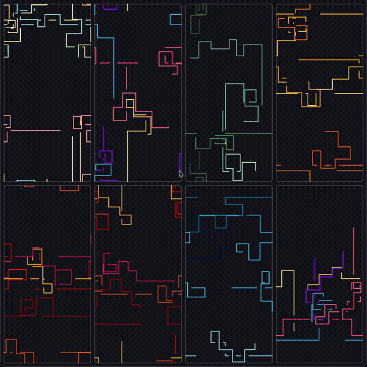
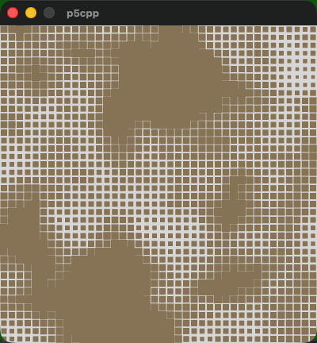
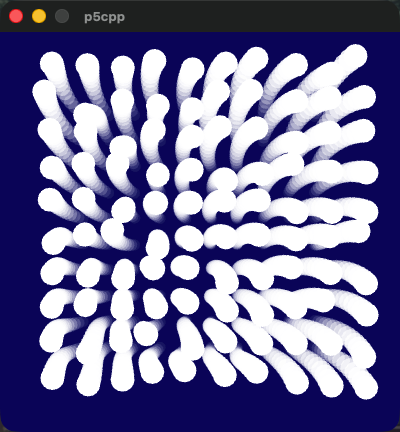
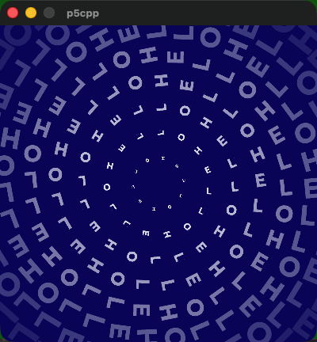

# p5cpp

A [p5.js](https://p5js.org/)/[Processing](https://processing.org/)-flavored creative coding framework for modern C++. It gives you the same immediate-mode drawing API, the same `setup()`/`draw()` sketch lifecycle, and the same "just start drawing" feel — backed by a real WebGPU renderer (via [wgpu-native](https://github.com/gfx-rs/wgpu-native)) and [GLFW](https://www.glfw.org/) windowing, written for C++23.

<p align="center">
  
</p>
<p align="center"><sub><code>examples/wanderer</code> — eight boards of colored wanderers carving out trails</sub></p>

<p align="center">
  
  
  
</p>

## Why p5cpp

- **No boilerplate.** You never write `main()`, open a window, or set up a render loop — implement `p5::Sketch` and return it from `p5::createSpec()`; p5cpp does the rest.
- **A real p5.js-style API.** `rect()`, `ellipse()`, `beginShape()`/`vertex()`/`endShape()`, `fill()`/`stroke()`, `push()`/`pop()`, `translate()`/`rotate()`, `noise()`, `map()`, `lerpColor()` — all free functions in `namespace p5`, called directly from `draw()`.
- **Actually fast.** Everything renders through a real GPU pipeline (WebGPU/wgpu-native), not a software rasterizer or an immediate OpenGL 1.x fallback.
- **Proper text.** Full text shaping via HarfBuzz + FreeType, glyph atlases, `textToPoints()` to turn any string into a polyline for further processing.
- **Batteries you can opt into.** Tweening/springs, audio, a 2D pan/zoom camera, GIF recording, a GUI, and webcam capture all ship as separate addon libraries — link only what you use.
- **Custom shaders in a few lines.** Write just a WGSL `effect()` function, LÖVE2D-pixel-shader style, and p5cpp supplies the vertex stage and boilerplate.

## Quick example

```cpp
// adapted from examples/disco_grid/main.cpp
#include <p5cpp/p5cpp.hpp>

using namespace p5;

struct DiscoGrid : Sketch
{
    size_t columns, rows;
    static constexpr size_t cellSize = 10;

    void setup() override
    {
        setWindowSize(400, 400);
        columns = getWindowSize().x / cellSize;
        rows = getWindowSize().y / cellSize;
    }

    void draw() override
    {
        background(rgba(220));
        noStroke();

        for (size_t y = 0; y < rows; ++y) {
            for (size_t x = 0; x < columns; ++x) {
                const float n = noise(x * 0.1f, y * 0.1f, static_cast<float>(getFrameCount()) * 0.01f);
                const float size = map(n, 0.0f, 1.0f, 0.0f, cellSize * 1.7f);

                fill(rgba(static_cast<int>(n * 255), 120, 200));
                rect(x * cellSize - size * 0.5f, y * cellSize - size * 0.5f, size, size);
            }
        }
    }
};

SketchSpec p5::createSpec()
{
    return {.sketch = [] { return std::make_unique<DiscoGrid>(); }};
}
```

That's the whole program — no `main()`, no window setup, no draw loop. `p5::createSpec()` is the single entry point p5cpp looks for; everything else (window, event pump, GPU device, frame timing) is wired up for you.

## Building

Dependencies are vendored as git submodules under `external/`, so a clone plus CMake is all you need:

```sh
git clone --recursive <repo-url> p5cpp
cd p5cpp
cmake -B build
cmake --build build -j

./build/examples/disco_grid/disco_grid
```

Requirements: a C++23 compiler and CMake 3.20+. On macOS the deployment target is pinned to 13.3+ (needed for `std::to_chars` support in libc++, which `std::format` relies on). `P5CPP_BUILD_EXAMPLES` (default `ON`) builds all example sketches alongside the library.

## Plugins

p5cpp's core (`p5cpp`) only knows about windowing, input, and 2D graphics. Everything else is an addon library you link explicitly and, for most of them, register as a plugin from `createSpec()`:

```cpp
using namespace p5;

SketchSpec p5::createSpec()
{
    return {
        .plugins = [] {
            std::vector<std::unique_ptr<Plugin>> plugins;
            plugins.push_back(gui::createGuiPlugin());
            return plugins;
        },
        .sketch = [] { return std::make_unique<MySketch>(); },
    };
}
```

| Addon                                     | CMake target      | Adds                                                                                                                                                                 |
| ----------------------------------------- | ----------------- | -------------------------------------------------------------------------------------------------------------------------------------------------------------------- |
| [`p5cpp_animation`](libs/p5cpp_animation) | `p5cpp_animation` | Tweens, springs, and easing curves, plus `sequential()`/`parallel()`/`race()`/`repeating()` combinators to compose them. Header-only, no plugin registration needed. |
| [`p5cpp_audio`](libs/p5cpp_audio)         | `p5cpp_audio`     | Loading and playing sounds (miniaudio-backed): volume/pitch/pan, looping, seeking, per-sound and master audio processors for custom DSP.                             |
| [`p5cpp_camera`](libs/p5cpp_camera)       | `p5cpp_camera`    | A PeasyCam-style 2D pan/zoom viewport camera — `beginCamera()`/`endCamera()`, screen↔world coordinate conversion, configurable zoom range and input locking.         |
| [`p5cpp_gif`](libs/p5cpp_gif)             | `p5cpp_gif`       | Records the canvas straight to an animated GIF, stopping after N frames, after N seconds, or on a custom predicate — with a built-in recording-progress overlay.     |
| [`p5cpp_gui`](libs/p5cpp_gui)             | `p5cpp_gui`       | An immediate-mode GUI overlay, a thin pass-through to [microui](https://github.com/rxi/microui) wired into the p5cpp render/input loop.                              |
| [`p5cpp_webcam`](libs/p5cpp_webcam)       | `p5cpp_webcam`    | Cross-platform webcam capture, exposed each frame as a `Texture` or raw `Pixels`.                                                                                    |

A tween from `p5cpp_animation` (no plugin needed — just call `advance()` each frame):

```cpp
#include <p5cpp_animation/p5cpp_animation.hpp>
using namespace p5::animation;

TweenTransition move = tween(1.5f, curves::easeInOutCubic, [this](float progress) {
    x = lerp(0.0f, 300.0f, progress);
});

// in draw():
move.advance(getDeltaTime());
```

## Examples

`examples/` has +20 complete sketches exercising most of the API — generative art, text/typography, image/pixel manipulation, GUI, audio-reactive visuals, GIF export, webcam, and the 2D camera. Each is its own CMake target under `build/examples/<name>/<name>` once built. A few worth a look: `wanderer`, `disco_grid` and `jelly_tentacles` (generative), `ripple_effect` (WGSL shaders), `rotating_typography` and `text_to_points` (text), `world_map`, `pixel_sorting` and `shuffled_glass` (pixel/image effects).

## Project layout

```
libs/p5cpp/     core library: window, input, graphics, text, WGSL shaders
libs/p5cpp_*/   addon libraries (see Plugins above)
examples/       one CMake target per example sketch
external/       vendored dependencies (git submodules)
```

## Shout outs

Special thanks to [Patt Vira (Youtube)](https://www.youtube.com/@pattvira) for giving me inspiration when making most of the examples inside the `examples` folder!
