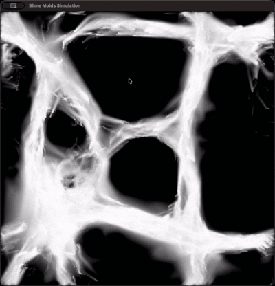
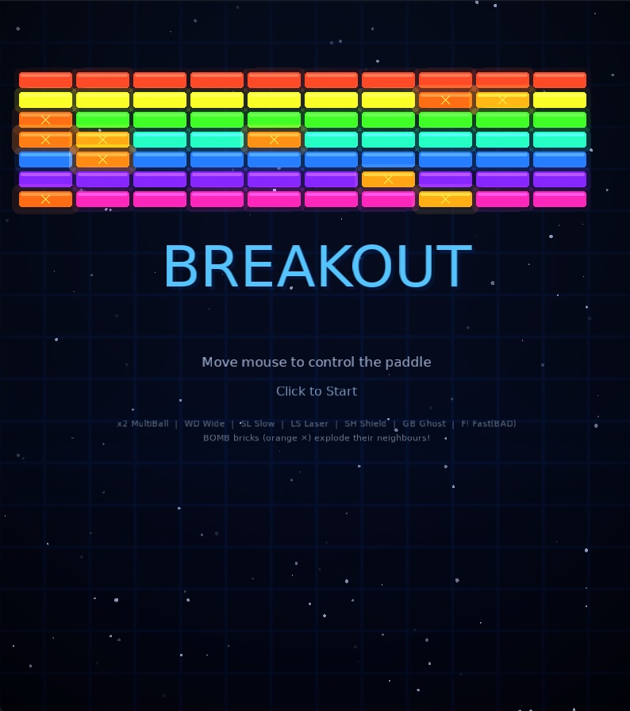
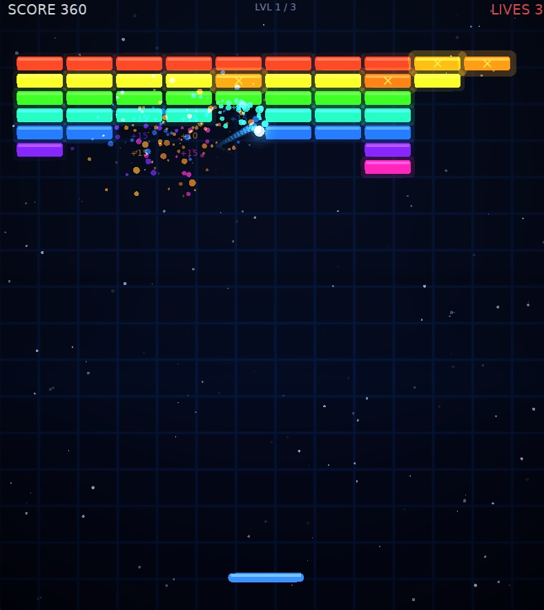
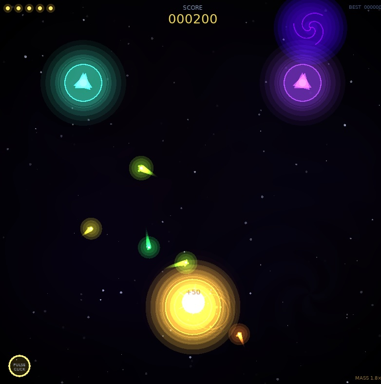
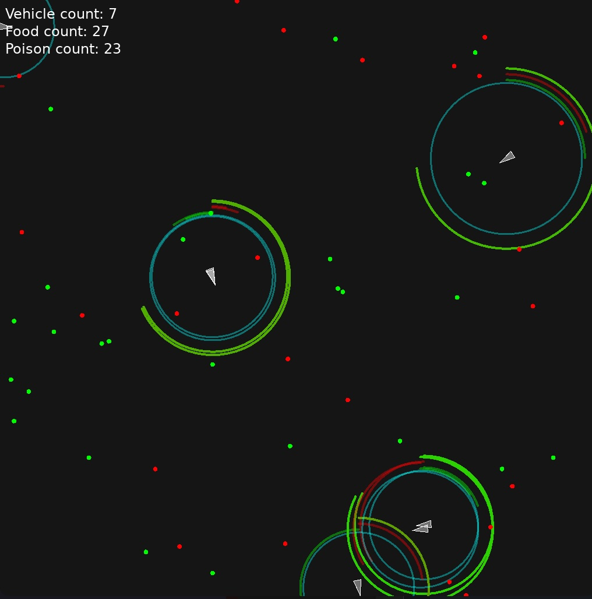
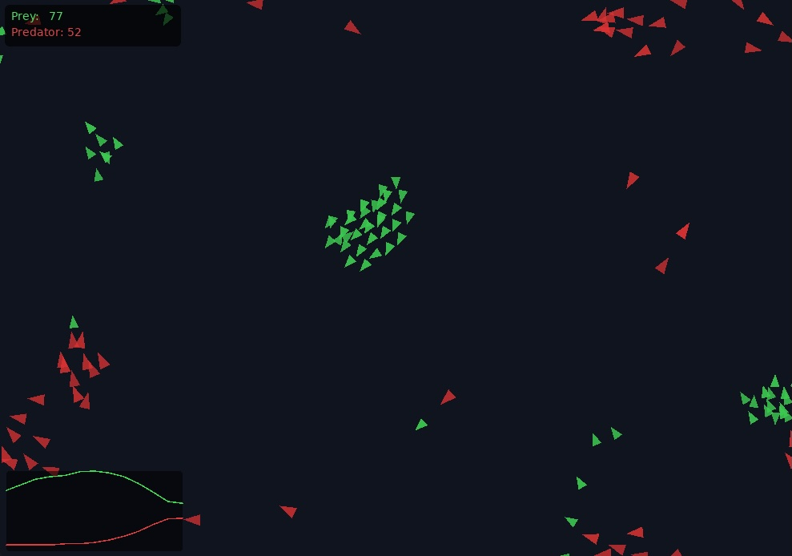

# p5cpp


[](https://github.com/FelixCpp/p5cpp/graphs/commit-activity)
[](https://github.com/FelixCpp/p5cpp/blob/main/LICENSE.txt)

> **p5.js creative coding — in native C++23.**

<p align="center">
  
</p>

`background()`, `fill()`, `circle()`, `noise()`, shaders, framebuffers, a particle system in 20 lines. If you've used Processing or p5.js you'll feel at home immediately — with the full power of native C++ and OpenGL underneath.

---

## Getting Started

```bash
git clone --recursive https://github.com/FelixCpp/p5cpp.git
cd p5cpp
cmake -S . -B build -DCMAKE_BUILD_TYPE=Release
cmake --build build --config Release --parallel
```

All dependencies (GLFW, FreeType, GLAD, libtess2, harfbuzz, miniaudio, stb) are bundled as git submodules — no separate installs needed.

---

## Your First Sketch

```cpp
#include <p5cpp/p5cpp.hpp>
using namespace p5cpp;

struct MySketch : Sketch
{
    void setup() override
    {
        setWindowSize(800, 600);
        setWindowTitle("Hello p5cpp");
        frameRate(60);
    }

    void draw() override
    {
        background(30);
        fill(255, 100, 0);
        noStroke();
        circle((float)getMouseX(), (float)getMouseY(), 40);
    }
};

std::unique_ptr<Sketch> p5cpp::createSketch()
{
    return std::make_unique<MySketch>();
}
```

The framework owns the window, render loop, and input — you just implement `setup()` and `draw()`.

## Screenshots

<p align="center">
  
  
  
  
  
</p>

## Why p5cpp?

If you love the simplicity of p5.js or Processing but need the performance,
control, and portability of native code, p5cpp bridges that gap.

### vs. p5.js / Processing

You get the same intuitive, sketch-based API you already know — but compiled,
faster, and without a browser or JVM in between. No more fighting with canvas
performance limits or JS garbage collection pauses in your creative-coding
projects.

### vs. openFrameworks / Cinder

Both are excellent, mature C++ creative-coding frameworks — but they come with
a much larger API surface and a steeper learning curve. p5cpp deliberately
stays small and focused: if you already think in p5.js terms (`setup()`,
`draw()`, `background()`, `ellipse()`), you'll feel at home immediately,
without learning a new mental model.

### vs. raw OpenGL / SFML

Building sketches directly on top of OpenGL or a low-level graphics library
means writing a lot of boilerplate before you draw your first shape. p5cpp
handles the setup, render loop, and drawing primitives for you, so you can
focus on the creative logic instead of graphics plumbing.

### When p5cpp is the right choice

- You're coming from p5.js/Processing and want native performance without
  relearning your whole workflow.
- You want something lighter-weight than a full framework like openFrameworks.
- You're prototyping visual/generative ideas and want fast iteration with
  minimal ceremony.

### When it might not be

- You need a battle-tested, large-ecosystem framework with tons of add-ons
  (→ openFrameworks).
- You're building a full game or complex interactive application, not a
  visual sketch (→ a game engine might fit better).

---

## Examples

### Shapes, Transforms & Curves

```cpp
void draw() override
{
    background(20);

    // Rounded rect
    fill(70, 130, 200);
    noStroke();
    rect(50, 50, 200, 120, BorderRadius{16});

    // Pie arc
    fill(255, 80, 80, 200);
    stroke(255, 80, 80);
    strokeWeight(2.0f);
    arc(500, 150, 100, 100, 0.0f, radians(240), ArcMode::pie);

    // Hexagon from vertices
    fill(180, 80, 220);
    noStroke();
    beginShape();
    for (int i = 0; i < 6; ++i)
    {
        float a = radians(60.0f * i - 30.0f);
        vertex(400 + std::cos(a) * 80, 350 + std::sin(a) * 80);
    }
    endShape(ShapeType::polygon);

    // Bézier curve
    noFill();
    stroke(255, 200, 50);
    strokeWeight(3.0f);
    bezier(100, 500, 150, 250, 550, 250, 600, 500);

    // Spinning square — local transform doesn't leak
    pushMatrix();
        translate((float)getLogicalWidth() / 2, (float)getLogicalHeight() / 2);
        rotate(getGlobalTime());
        fill(255);
        noStroke();
        rect(-30, -30, 60, 60);
    popMatrix();
}
```

---

### Particle System

HSV color cycling, additive blending, motion-blur trails, gravity, and an interactive mouse-driven vortex emitter with click-to-explode bursts:

```cpp
#include <p5cpp/p5cpp.hpp>
#include <algorithm>
#include <cmath>
#include <vector>
using namespace p5cpp;

// HSV → RGBA (h: 0–360, s/v: 0–1)
static color_t hsv(float h, float s, float v, int a = 255)
{
    h = std::fmod(h, 360.f);
    const float c = v * s;
    const float x = c * (1.f - std::abs(std::fmod(h / 60.f, 2.f) - 1.f));
    const float m = v - c;
    float r, g, b;
    if      (h < 60)  { r = c; g = x; b = 0; }
    else if (h < 120) { r = x; g = c; b = 0; }
    else if (h < 180) { r = 0; g = c; b = x; }
    else if (h < 240) { r = 0; g = x; b = c; }
    else if (h < 300) { r = x; g = 0; b = c; }
    else              { r = c; g = 0; b = x; }
    return rgba((int)((r+m)*255), (int)((g+m)*255), (int)((b+m)*255), a);
}

struct Particle { float2 pos, vel; float life, maxLife, hue, size; };

struct GalaxySketch : Sketch
{
    std::vector<Particle> particles;
    float hueOffset = 0.f;

    void setup() override
    {
        setWindowSize(900, 700);
        setWindowTitle("Galaxy Vortex  |  Move mouse · Click to explode");
        particles.reserve(8000);
    }

    void draw() override
    {
        background(4, 4, 12, 18); // low-alpha clear → motion-blur trail

        const float dt = getDeltaTime();
        const float cx = (float)getMouseX();
        const float cy = (float)getMouseY();
        hueOffset += dt * 50.f;

        for (int i = 0; i < 10; ++i)
        {
            const float angle = randomFloat(0.f, TWO_PI);
            const float speed = randomFloat(100.f, 320.f);
            const float life  = randomFloat(1.2f, 3.0f);
            float2 dir    = float2::fromAngle(angle);
            float2 vel    = dir * speed + dir.perpendicular() * randomFloat(-80.f, 80.f);
            vel.y -= randomFloat(10.f, 40.f);
            particles.push_back({
                .pos = {cx + dir.x * randomFloat(20.f), cy + dir.y * randomFloat(20.f)},
                .vel = vel, .life = life, .maxLife = life,
                .hue = hueOffset + angle * (180.f / PI), .size = randomFloat(5.f, 15.f),
            });
        }

        blendMode(BlendMode::additive); // overlapping particles bloom and glow
        noStroke();

        for (auto& p : particles)
        {
            p.vel.y += 120.f * dt;  // gravity
            p.vel   *= 0.993f;      // drag
            p.pos   += p.vel * dt;
            p.life  -= dt;
            const float t = p.life / p.maxLife;
            fill(hsv(p.hue, 1.f, 1.f, (int)(t * t * 210.f)));
            circle(p.pos.x, p.pos.y, p.size * t);
        }

        blendMode(BlendMode::alpha);
        std::erase_if(particles, [](const Particle& p) { return p.life <= 0.f; });
    }

    void event(const WindowEvent& e) override
    {
        if (e.type == EventType::mousePress)
        {
            for (int i = 0; i < 160; ++i)
            {
                const float a = TWO_PI * i / 160.f;
                const float life = randomFloat(1.0f, 2.5f);
                particles.push_back({
                    .pos = {(float)getMouseX(), (float)getMouseY()},
                    .vel = float2::fromAngle(a) * randomFloat(150.f, 600.f),
                    .life = life, .maxLife = life,
                    .hue = hueOffset + a * (180.f / PI), .size = randomFloat(3.f, 9.f),
                });
            }
        }
        if (e.type == EventType::keyPress && e.keyEvent.key == Key::escape) quit();
    }
};

std::unique_ptr<Sketch> p5cpp::createSketch()
{
    return std::make_unique<GalaxySketch>();
}
```

---

### Perlin Noise Flow Field

```cpp
void draw() override
{
    background(10);
    stroke(255, 255, 255, 50);
    strokeWeight(1.0f);
    const float t = getGlobalTime() * 0.25f;

    for (int x = 0; x < getLogicalWidth(); x += 18)
    {
        for (int y = 0; y < getLogicalHeight(); y += 18)
        {
            float angle = noise(x * 0.004f, y * 0.004f, t) * TWO_PI * 2.0f;
            line((float)x, (float)y,
                 x + std::cos(angle) * 12.f,
                 y + std::sin(angle) * 12.f);
        }
    }
}
```

---

### GLSL Shaders

Bind any GLSL shader and push uniforms before drawing shapes — the built-in batch renderer picks it up automatically:

```cpp
const char* frag = R"glsl(
    #version 410 core
    uniform float uTime;
    uniform vec2  uResolution;
    out vec4 FragColor;
    void main()
    {
        vec2 uv = gl_FragCoord.xy / uResolution;
        float r = 0.5 + 0.5 * sin(uTime + uv.x * 6.28);
        FragColor = vec4(r, 0.3, 1.0 - r, 1.0);
    }
)glsl";

struct GradientSketch : Sketch
{
    Shader sh;

    void setup() override
    {
        // vertex shader omitted for brevity — use the passthrough vert
        sh = loadShader(vertSrc, frag);
        setWindowSize(800, 600);
    }

    void draw() override
    {
        background(0);
        shader(sh);
        setUniform("uTime",       uniform(getGlobalTime()));
        setUniform("uResolution", uniform((float)getLogicalWidth(), (float)getLogicalHeight()));
        rect(0, 0, (float)getLogicalWidth(), (float)getLogicalHeight());
        noShader();
    }

    void destroy() override
    {
        unload(sh);
    }
};
```

---

### Offscreen Framebuffer

Render into an offscreen canvas, then use it as a texture:

```cpp
struct PostFXSketch : Sketch
{
    Framebuffer canvas;

    void setup() override
    {
        canvas = createFramebuffer(512, 512);
        setWindowSize(800, 600);
    }

    void draw() override
    {
        pushCanvas(canvas);
            background(10, 30, 60);
            fill(255, 200, 50);
            noStroke();
            circle(256, 256 + std::sin(getGlobalTime()) * 80, 120);
        popCanvas();

        background(20);
        tint(200, 150, 255); // colour-grade the result
        image(canvas.colorTexture, 144, 44, 512, 512);
        noTint();
    }

    void destroy() override
    {
        unload(canvas);
    }
};
```

---

### Post-Processing Effects

There's no dedicated "effect"/"filter" API — a post-processing pass is just a `Shader`,
applied like any other `shader()` call while drawing a `Framebuffer`'s contents back out
via `image()`. Render the scene you want to post-process into an offscreen `Framebuffer`
first (see above), then draw it through the shader:

```cpp
struct PostFXSketch : Sketch
{
    Framebuffer scene;
    Shader glowShader;

    void setup() override
    {
        setWindowSize(800, 600);
        scene = createFramebuffer(800, 600);
        glowShader = loadBlurShader(); // built-in convenience shader, see shader.hpp
    }

    void draw() override
    {
        pushCanvas(scene);
            background(10);
            noStroke();
            for (auto& p : particles)
            {
                fill(p.color);
                circle(p.pos.x, p.pos.y, p.size);
            }
        popCanvas();

        shader(glowShader);
        setUniform(glowShader, "u_TexelSize", uniform(1.0f / 800.0f, 1.0f / 600.0f));
        setUniform(glowShader, "u_Radius", uniform(6.0f));
        setUniform(glowShader, "u_Direction", uniform(1.0f, 0.0f));
        image(scene.colorTexture, 0, 0, 800, 600); // horizontal blur pass

        // A custom full-screen shader works the same way — write only the pixel
        // function, loadEffectShader() supplies the rest:
        //     shader(myPostFxShader);
        //     setUniform(myPostFxShader, "uTime", uniform(getGlobalTime()));
        //     image(scene.colorTexture, 0, 0, 800, 600);
        noShader();
    }

    void destroy() override
    {
        unload(scene);
        unload(glowShader);
    }
};
```

Built-in convenience shaders (`loadGrayscaleShader()`, `loadInvertShader()`,
`loadThresholdShader()`, `loadBlurShader()`) live in `shader.hpp` — they're regular
`Shader`s, nothing about applying them is special. `loadBlurShader()` is a *separable*
gaussian blur, so a real blur needs two passes (horizontal into a scratch `Framebuffer`,
then vertical from that scratch buffer onto the final target) — see
`examples/custom_effects` for the full two-pass version.

---

### Resource management

`Texture`, `Framebuffer`, and `Shader` are plain structs with no automatic cleanup —
`loadTexture()`/`loadImage()`/`createFramebuffer()`/`loadShader()` and friends must be
paired with an explicit `unload()` call once you're done with the resource (typically in
`destroy()` for anything loaded in `setup()`), the same way raylib's `LoadTexture()`/
`UnloadTexture()` work:

```cpp
unload(texture);
unload(framebuffer); // also unloads framebuffer.colorTexture
unload(shader);
```

Calling `unload()` twice on the same variable is a harmless no-op; forgetting to call it
at all leaks the underlying GPU resource. `Font`, `Sound`, and `AudioStream` are the
exception — they're reference-counted and clean themselves up automatically, no
`unload()` needed.

These three types are plain data — no methods, matching raylib's `Texture2D`/`Shader`/
`RenderTexture2D` structs. Everything that acts on them is a free function:
`isTextureValid(texture)`/`isFramebufferValid(fb)`/`isShaderValid(shader)` (e.g. to
check whether `loadImage()` actually decoded something), `upload()`/`updateRegion()`
for `Texture`, `readPixels()`/`writePixels()` for `Framebuffer`, `getUniformLocation()`
for `Shader`. None of these check their argument's validity for you (matching raylib's
`UpdateTexture()`/`GetShaderLocation()`, which don't either) — only `unload()` does,
silently, so double-unloading is still harmless.

---

### Images, Screenshots & Pixels

Load PNG/JPG/BMP files from disk (or memory) straight into a `Texture`, and read pixels back
off any canvas — the main window canvas or an offscreen `Framebuffer`:

```cpp
struct ImageSketch : Sketch
{
    Texture logo;

    void setup() override
    {
        setWindowSize(800, 600);
        logo = loadImage("example_assets/logo.png"); // also: loadImage(std::span<const uint8_t>)
    }

    void draw() override
    {
        background(20);
        image(logo, 50, 50, (float)logo.size.x, (float)logo.size.y);
    }

    void event(const WindowEvent& e) override
    {
        // Screenshot the whole window canvas to disk
        if (e.type == EventType::keyPress && e.keyEvent.key == Key::s)
        {
            const uint2 size = getCanvasSize();
            saveImage("screenshot.png", size.x, size.y, loadPixels());
        }
    }

    void destroy() override
    {
        unload(logo);
    }
};
```

`loadPixels()` snapshots the currently active canvas into a `std::vector<color_t>` you can
inspect or mutate on the CPU; `Framebuffer::readPixels()` does the same for an explicit
offscreen buffer, and `saveImage(path, framebuffer)` writes one straight to a PNG file:

```cpp
Framebuffer fb = createFramebuffer(256, 256);
pushCanvas(fb);
    background(255, 0, 0);
popCanvas();

saveImage("red_square.png", fb);
std::vector<color_t> pixels = readPixels(fb); // raw R,G,B,A bytes per pixel, top-left origin

unload(fb); // Texture/Framebuffer/Shader have no automatic cleanup - see "Resource management" below
```

> **Note:** pixel buffers returned by `loadPixels()`/`readPixels()` (and consumed by
> `saveImage()`/produced by `loadImage()`) store raw R,G,B,A bytes — the same layout the GPU
> always uses for texture data. This is a different in-memory layout than the bit-packed value
> `rgba()`/`red()`/`green()`/`blue()`/`alpha()` work with, so don't round-trip pixel-buffer
> values through those helpers — they're for vertex/fill/stroke colours, not raw pixel data.

---

### Audio

Load and play sounds through a `miniaudio`-backed engine, control per-sound volume/pan/pitch/
looping, and drive visuals from live playback analysis (RMS amplitude + a raw waveform ring
buffer):

```cpp
struct AudioSketch : Sketch
{
    Sound tone;

    void setup() override
    {
        setWindowSize(800, 500);
        tone = loadSound("example_assets/tone.wav"); // also: loadSound(std::span<const uint8_t>)
        tone.setLoop(true);
        masterVolume(0.8f);
    }

    void event(const WindowEvent& e) override
    {
        if (e.type == EventType::keyPress && e.keyEvent.key == Key::space)
            isPlaying(tone) ? pauseSound(tone) : playSound(tone);
    }

    void draw() override
    {
        background(15);

        // Audio-reactive circle, driven by the engine's live RMS amplitude
        const float amp = getAudioAmplitude();
        noStroke();
        fill(255, 120, 80);
        circle(400, 150, 30.f + amp * 260.f);

        // Oscilloscope from the live waveform ring buffer
        noFill();
        stroke(80, 200, 255);
        beginShape();
        auto waveform = getAudioWaveform();
        for (size_t i = 0; i < waveform.size(); ++i)
            vertex(800.f * i / (float)waveform.size(), 350.f + waveform[i] * 100.f);
        endShape(ShapeType::lineStrip, false);
    }
};
```

`Sound` handles are cheap to copy (reference-counted) and expose per-sound `setVolume()`,
`getVolume()`, `setPan()`, `getPan()`, `setRate()` (pitch), `getRate()`, `setLoop()` and
`isLooping()`; playback itself goes through the free functions `playSound()` / `stopSound()`
(rewinds) / `pauseSound()` (keeps position) / `isPlaying()`, mirroring how `image()` takes a
`Texture` rather than the texture "drawing itself".

---

### Input & Events

```cpp
struct InputSketch : Sketch
{
    bool paused = false;

    void setup() override { setWindowSize(800, 600); }

    void draw() override
    {
        background(40);
        if (!paused)
        {
            fill(100, 200, 255);
            noStroke();
            circle((float)getMouseX(), (float)getMouseY(), 60);
        }
    }

    void event(const WindowEvent& e) override
    {
        if (e.type == EventType::keyPress && e.keyEvent.key == Key::space)
            paused = !paused;

        if (e.type == EventType::mousePress && e.mouseButton.button == MouseButton::left)
            info(std::format("click at {}, {}", getMouseX(), getMouseY()));

        if (e.type == EventType::keyPress && e.keyEvent.key == Key::escape)
            quit();
    }
};
```

`event(WindowEvent&)` is best for one-shot reactions (a click, a key press that toggles
something). For "is this held down right now" checks inside `draw()`, poll instead:

```cpp
void draw() override
{
    if (isKeyDown(Key::right)) x += speed * getDeltaTime();  // continuous, true every frame it's held
    if (isKeyPressed(Key::space)) jump();                    // true only on the frame it went down
    if (isMouseDown(MouseButton::left)) paint();
    if (isKeyReleased(Key::leftShift)) stopSprinting();       // true only on the frame it went up
}
```

`isKeyPressed`/`isKeyReleased`/`isMousePressed`/`isMouseReleased` are edge-triggered — each
stays true for exactly the one `draw()` call in which the transition happened (OS key-repeat
does not re-trigger `isKeyPressed`). `isKeyDown`/`isMouseDown` are continuous state.

A handful of keys are bound by the framework itself, independent of your sketch's `event()`:

| Key           | Effect                                     |
| ------------- | ------------------------------------------ |
| `Escape`      | quit                                       |
| `Space`       | toggle `loop()`/`noLoop()`                 |
| `Alt` + `Enter` | toggle fullscreen                        |
| `Ctrl` + `R`  | restart the sketch                         |

---

### RenderGroup (cached geometry)

Every `rect()`/`ellipse()`/`beginShape()…endShape()` call re-tessellates its geometry from
scratch, every frame. For complex or static shapes, build the geometry once and replay it
cheaply instead:

```cpp
RenderGroup blob;

void setup() override
{
    blob = buildRenderGroup([] {
        fill(200, 100, 50);
        stroke(0);
        strokeWeight(3);
        beginShape();
        for (int i = 0; i < 200; ++i) {
            const float a = TWO_PI * i / 200.0f;
            vertex(std::cos(a) * 40.0f, std::sin(a) * 40.0f);
        }
        endShape(ShapeType::polygon, true);
    });
}

void draw() override
{
    background(230);
    pushMatrix();
    translate((float)getMouseX(), (float)getMouseY());
    rotate(getGlobalTime());
    drawRenderGroup(blob);   // replays the cached geometry — no re-tessellation
    popMatrix();
}
```

`buildRenderGroup()` runs its lambda with its own isolated transform and fill/stroke state
(starts at identity / sketch defaults, independent of whatever is active at the call site), so
the returned `RenderGroup` is a self-contained, freely repositionable unit — move/rotate/scale
it at replay time via the normal matrix stack. Inside the lambda you can use any of `rect()`,
`ellipse()`/`circle()`, `triangle()`, `point()`, `line()`, `arc()`, `bezier()`, `curve()`,
`beginShape()`/`vertex()`/`endShape()`, `image()`, `text()`, and custom `shader()`/`setUniform()`
(the uniform values are frozen at build time). You can also call `drawRenderGroup()` on another,
already-built group to compose groups out of groups. `background()` and
`pushCanvas()`/`popCanvas()` are not supported inside `buildRenderGroup()` (they don't operate
on shape-local geometry — `background()` always fills the whole current canvas, and a
`RenderGroup` has no framebuffer association).

```cpp
void draw() override
{
    drawRenderGroup(blob, (float)getMouseX(), (float)getMouseY());  // sugar for translate(x,y) + drawRenderGroup(blob)
}
```

---

### Custom Engine Modules _(advanced)_

p5cpp's engine is a middleware pipeline. You can inject your own module anywhere in the
lifecycle — useful for shared services (audio, networking, physics) that multiple sketches
or subsystems depend on:

```cpp
struct TimerModule : p5cpp::Module
{
    float elapsed = 0.f;

    void setup(AppContext& ctx, Next next) override
    {
        ctx.registerService<TimerModule>(this);
        next(); // always call next() to let downstream modules run
    }

    void draw(AppContext& ctx, Next next) override
    {
        elapsed += getDeltaTime();
        next();
    }

    void destroy(AppContext& ctx, Next next) override
    {
        ctx.unregisterService<TimerModule>();
        next();
    }
};
```

Register it before the Sketch module in `p5cpp.cpp`, then retrieve it from any API function via `ctx.require<TimerModule>()`.

### Modules Before/After Your Sketch _(advanced)_

`plugins()` registers modules globally, with no control over where they end up relative to
your own `setup()`/`draw()`/`event()`/`destroy()` calls. If you need a module to run right
before or right after your sketch's own call — every frame, deterministically — implement
`registerModules(ModuleRegistrar&)` instead:

```cpp
struct LogBeforeModule : p5cpp::Module
{
    void draw(AppContext& ctx, Next next) override
    {
        p5cpp::info("before sketch draw");
        next();
    }
};

struct LogAfterModule : p5cpp::Module
{
    void draw(AppContext& ctx, Next next) override
    {
        next();
        p5cpp::info("after sketch draw");
    }
};

struct MySketch : p5cpp::Sketch
{
    void registerModules(p5cpp::ModuleRegistrar& registrar) override
    {
        registrar.addModuleBefore(std::make_unique<LogBeforeModule>());
        registrar.addModuleAfter(std::make_unique<LogAfterModule>());
    }

    void setup() override { /* ... */ }
    void draw() override { /* ... */ }
};
```

Each frame this logs `before sketch draw`, then runs your sketch's `draw()`, then logs
`after sketch draw`. Modules registered this way still follow the same middleware contract
as any other `Module` — code before `next()` runs first, code after runs last — they're just
anchored relative to your sketch instead of the global module list.

---

## API Cheatsheet

### Sketch lifecycle

| Method                | When                     |
| --------------------- | ------------------------ |
| `setup()`             | once at startup          |
| `draw()`              | every frame              |
| `event(WindowEvent&)` | on input / window events |
| `destroy()`           | on shutdown - `unload()` any Texture/Framebuffer/Shader you loaded here |

### Drawing

|                                                        |                          |
| ------------------------------------------------------ | ------------------------ |
| `background(r,g,b)`                                    | clear canvas             |
| `fill(r,g,b,a)` / `noFill()`                           | fill colour              |
| `stroke(r,g,b,a)` / `noStroke()`                       | stroke colour            |
| `strokeWeight(w)`                                      | line thickness           |
| `rect(x,y,w,h)` / `rect(x,y,w,h, BorderRadius)`        | rectangle / rounded rect |
| `circle(cx,cy,r)` / `ellipse(cx,cy,rx,ry)`             | circle / ellipse         |
| `line(x1,y1,x2,y2)`                                    | line                     |
| `triangle(x1,y1,…)`                                    | triangle                 |
| `arc(cx,cy,rx,ry,start,sweep,ArcMode)`                 | arc / pie                |
| `bezier(…)` / `curve(…)`                               | Bézier / Catmull-Rom     |
| `beginShape()` / `vertex(x,y)` / `endShape(ShapeType)` | custom polygon           |
| `image(texture,x,y,w,h)`                               | draw texture             |
| `text(str,x,y)` / `text(str,x,y,maxWidth)`             | draw text                |
| `textLayout(str,x,y[,maxWidth])` → `TextLayout`        | measure text (lines, width, height, bounds) without drawing |
| `shader(s)` / `noShader()`                             | active shader for drawing (incl. post-processing, see above) |

### RenderGroup

```cpp
RenderGroup group = buildRenderGroup([] { /* rect()/ellipse()/beginShape()-.../image()/... */ });
drawRenderGroup(group);            // replay at the current transform
drawRenderGroup(group, x, y);      // sugar: translate(x,y) + drawRenderGroup(group)
```

### Transforms & state

```cpp
pushMatrix();  translate(x,y);  rotate(rad);  scale(x,y);  popMatrix();
pushState();  /* change fill/stroke/blend */  popState();
pushCanvas(fb);  /* draw into framebuffer */  popCanvas();
```

### Colour helpers

```cpp
color_t c = rgba(r, g, b, a);
color_t c = lighten(c, 0.3f);   // or darken, withAlpha, lerp
int r = red(c);  // also green(), blue(), alpha(), brightness()
```

### Math & noise

```cpp
noise(x)  /  noise(x,y)  /  noise(x,y,z)   // Perlin noise → 0..1
randomFloat(min, max)   randomInt(min, max)   randomDirection<float>()
radians(deg)   degrees(rad)   remap(v, lo, hi, newLo, newHi)
```

### `float2` vector math

```cpp
float2 v = {1.f, 0.f};
v += other;   v *= scalar;
dot(a,b)   cross(a,b)   length(v)   normalized(v)
lerp(a,b,t)   limit(v, maxLen)   perp(v)
```

### Input polling

```cpp
isKeyDown(Key::right)          // true every frame the key is held
isKeyPressed(Key::space)       // true only on the frame it went down
isKeyReleased(Key::leftShift)  // true only on the frame it went up

isMouseDown(MouseButton::left)
isMousePressed(MouseButton::left)
isMouseReleased(MouseButton::left)
```

### Window & environment

```cpp
setWindowSize(w, h)          setWindowTitle("...")        setWindowResizable(true)
setFullscreen(true)          isFullscreen()                // toggled by Alt+Enter by default, too
```

### Timing & control

```cpp
getDeltaTime()     // seconds since last frame
getGlobalTime()    // seconds since start
getFrameCount()    // total frames rendered
frameRate(fps)     // target FPS cap
loop() / noLoop()  // resume / pause draw()
quit()             // exit cleanly
```

### Images, screenshots & pixels

```cpp
Texture t = loadImage("path.png");            // also: loadImage(std::span<const uint8_t>)
saveImage("out.png", framebuffer);             // encode a Framebuffer to PNG
saveImage("out.png", w, h, pixels);            // encode a raw pixel buffer to PNG

std::vector<color_t> pixels = loadPixels();    // snapshot of the current canvas
std::vector<color_t> pixels = readPixels(fb); // snapshot of an offscreen Framebuffer

unload(t);                                     // no automatic cleanup - see "Resource management" below
```

### Audio

```cpp
Sound s = loadSound("path.wav");               // also: loadSound(std::span<const uint8_t>)
playSound(s);  stopSound(s);  pauseSound(s);  isPlaying(s);
s.setVolume(v);  s.setPan(p);  s.setRate(r);  s.setLoop(true);

masterVolume(v);  getMasterVolume();
getAudioAmplitude();   // live RMS level, 0..~1
getAudioWaveform();    // std::span<const float> — live waveform ring buffer
```

---

## Dependencies

All bundled as git submodules — nothing to install.

| Library                                           | Purpose                                        |
| ------------------------------------------------- | ---------------------------------------------- |
| [GLFW](https://www.glfw.org/)                     | Window, OpenGL context, raw input              |
| [GLAD](https://glad.dav1d.de/)                    | OpenGL function loader                         |
| [FreeType](https://freetype.org/)                 | Font loading & glyph rasterisation             |
| [libtess2](https://github.com/memononen/libtess2) | Polygon tessellation (`beginShape`/`endShape`) |
| [harfbuzz](https://github.com/harfbuzz/harfbuzz)  | Text shaping (ligature support)                |
| [miniaudio](https://miniaud.io/)                  | Audio playback, mixing & analysis              |
| [stb](https://github.com/nothings/stb)            | Image loading & PNG encoding (`stb_image` / `stb_image_write`) |

---

## Credits & License

Inspired by [Processing](https://processing.org/) (Casey Reas & Ben Fry) and [p5.js](https://p5js.org/) (Lauren McCarthy). Not affiliated with or endorsed by either project.

See `LICENSE.txt` for details.
