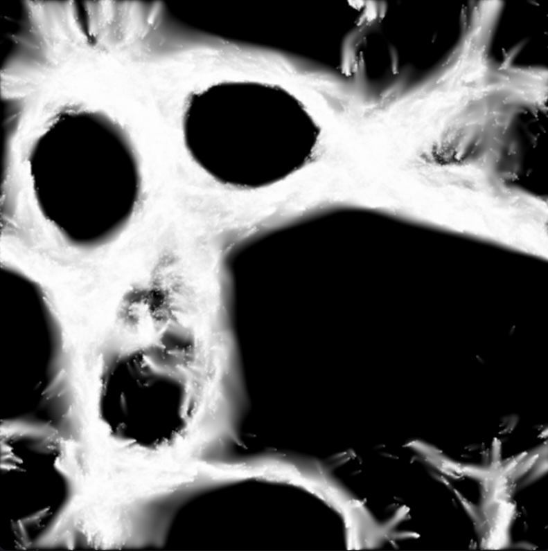

# p5cpp


[](https://github.com/FelixCpp/p5cpp/graphs/commit-activity)
[](https://github.com/FelixCpp/p5cpp/blob/main/LICENSE.txt)

> **p5.js creative coding — in native C++23.**

`background()`, `fill()`, `circle()`, `noise()`, shaders, framebuffers, a particle system in 20 lines. If you've used Processing or p5.js you'll feel at home immediately — with the full power of native C++ and OpenGL underneath.

<video width="320" height="240" controls>
  <source src="video.mov" type="./gitassets/Gravitas showcase.mp4">
</video>

<p align="middle">
    
    
    
    
    
    
</p>

---

## Getting Started

```bash
git clone --recursive https://github.com/FelixCpp/p5cpp.git
cd p5cpp
cmake -S . -B build -DCMAKE_BUILD_TYPE=Release
cmake --build build --config Release --parallel
```

All dependencies (GLFW, FreeType, GLAD, libtess2, harfbuzz) are bundled as git submodules — no separate installs needed.

---

## Your First Sketch

```cpp
#include <p5cpp/p5cpp.hpp>
using namespace p5cpp;

struct MySketch : Sketch
{
    void setup() override
    {
        setWindowSize(800, 600);
        setWindowTitle("Hello p5cpp");
        frameRate(60);
    }

    void draw() override
    {
        background(30);
        fill(255, 100, 0);
        noStroke();
        circle((float)getMouseX(), (float)getMouseY(), 40);
    }
};

std::unique_ptr<Sketch> p5cpp::createSketch()
{
    return std::make_unique<MySketch>();
}
```

The framework owns the window, render loop, and input — you just implement `setup()` and `draw()`.

## Why p5cpp?

If you love the simplicity of p5.js or Processing but need the performance,
control, and portability of native code, p5cpp bridges that gap.

### vs. p5.js / Processing

You get the same intuitive, sketch-based API you already know — but compiled,
faster, and without a browser or JVM in between. No more fighting with canvas
performance limits or JS garbage collection pauses in your creative-coding
projects.

### vs. openFrameworks / Cinder

Both are excellent, mature C++ creative-coding frameworks — but they come with
a much larger API surface and a steeper learning curve. p5cpp deliberately
stays small and focused: if you already think in p5.js terms (`setup()`,
`draw()`, `background()`, `ellipse()`), you'll feel at home immediately,
without learning a new mental model.

### vs. raw OpenGL / SFML

Building sketches directly on top of OpenGL or a low-level graphics library
means writing a lot of boilerplate before you draw your first shape. p5cpp
handles the setup, render loop, and drawing primitives for you, so you can
focus on the creative logic instead of graphics plumbing.

### When p5cpp is the right choice

- You're coming from p5.js/Processing and want native performance without
  relearning your whole workflow.
- You want something lighter-weight than a full framework like openFrameworks.
- You're prototyping visual/generative ideas and want fast iteration with
  minimal ceremony.

### When it might not be

- You need a battle-tested, large-ecosystem framework with tons of add-ons
  (→ openFrameworks).
- You're building a full game or complex interactive application, not a
  visual sketch (→ a game engine might fit better).

---

## Examples

### Shapes, Transforms & Curves

```cpp
void draw() override
{
    background(20);

    // Rounded rect
    fill(70, 130, 200);
    noStroke();
    rect(50, 50, 200, 120, BorderRadius{16});

    // Pie arc
    fill(255, 80, 80, 200);
    stroke(255, 80, 80);
    strokeWeight(2.0f);
    arc(500, 150, 100, 100, 0.0f, radians(240), ArcMode::pie);

    // Hexagon from vertices
    fill(180, 80, 220);
    noStroke();
    beginShape();
    for (int i = 0; i < 6; ++i)
    {
        float a = radians(60.0f * i - 30.0f);
        vertex(400 + std::cos(a) * 80, 350 + std::sin(a) * 80);
    }
    endShape(ShapeType::polygon);

    // Bézier curve
    noFill();
    stroke(255, 200, 50);
    strokeWeight(3.0f);
    bezier(100, 500, 150, 250, 550, 250, 600, 500);

    // Spinning square — local transform doesn't leak
    pushMatrix();
        translate((float)getLogicalWidth() / 2, (float)getLogicalHeight() / 2);
        rotate(getGlobalTime());
        fill(255);
        noStroke();
        rect(-30, -30, 60, 60);
    popMatrix();
}
```

---

### Particle System

HSV color cycling, additive blending, motion-blur trails, gravity, and an interactive mouse-driven vortex emitter with click-to-explode bursts:

```cpp
#include <p5cpp/p5cpp.hpp>
#include <algorithm>
#include <cmath>
#include <vector>
using namespace p5cpp;

// HSV → RGBA (h: 0–360, s/v: 0–1)
static color_t hsv(float h, float s, float v, int a = 255)
{
    h = std::fmod(h, 360.f);
    const float c = v * s;
    const float x = c * (1.f - std::abs(std::fmod(h / 60.f, 2.f) - 1.f));
    const float m = v - c;
    float r, g, b;
    if      (h < 60)  { r = c; g = x; b = 0; }
    else if (h < 120) { r = x; g = c; b = 0; }
    else if (h < 180) { r = 0; g = c; b = x; }
    else if (h < 240) { r = 0; g = x; b = c; }
    else if (h < 300) { r = x; g = 0; b = c; }
    else              { r = c; g = 0; b = x; }
    return rgba((int)((r+m)*255), (int)((g+m)*255), (int)((b+m)*255), a);
}

struct Particle { float2 pos, vel; float life, maxLife, hue, size; };

struct GalaxySketch : Sketch
{
    std::vector<Particle> particles;
    float hueOffset = 0.f;

    void setup() override
    {
        setWindowSize(900, 700);
        setWindowTitle("Galaxy Vortex  |  Move mouse · Click to explode");
        particles.reserve(8000);
    }

    void draw() override
    {
        background(4, 4, 12, 18); // low-alpha clear → motion-blur trail

        const float dt = getDeltaTime();
        const float cx = (float)getMouseX();
        const float cy = (float)getMouseY();
        hueOffset += dt * 50.f;

        for (int i = 0; i < 10; ++i)
        {
            const float angle = randomFloat(0.f, TWO_PI);
            const float speed = randomFloat(100.f, 320.f);
            const float life  = randomFloat(1.2f, 3.0f);
            float2 dir    = float2::fromAngle(angle);
            float2 vel    = dir * speed + dir.perpendicular() * randomFloat(-80.f, 80.f);
            vel.y -= randomFloat(10.f, 40.f);
            particles.push_back({
                .pos = {cx + dir.x * randomFloat(20.f), cy + dir.y * randomFloat(20.f)},
                .vel = vel, .life = life, .maxLife = life,
                .hue = hueOffset + angle * (180.f / PI), .size = randomFloat(5.f, 15.f),
            });
        }

        blendMode(BlendMode::additive); // overlapping particles bloom and glow
        noStroke();

        for (auto& p : particles)
        {
            p.vel.y += 120.f * dt;  // gravity
            p.vel   *= 0.993f;      // drag
            p.pos   += p.vel * dt;
            p.life  -= dt;
            const float t = p.life / p.maxLife;
            fill(hsv(p.hue, 1.f, 1.f, (int)(t * t * 210.f)));
            circle(p.pos.x, p.pos.y, p.size * t);
        }

        blendMode(BlendMode::alpha);
        std::erase_if(particles, [](const Particle& p) { return p.life <= 0.f; });
    }

    void event(const WindowEvent& e) override
    {
        if (e.type == EventType::mousePress)
        {
            for (int i = 0; i < 160; ++i)
            {
                const float a = TWO_PI * i / 160.f;
                const float life = randomFloat(1.0f, 2.5f);
                particles.push_back({
                    .pos = {(float)getMouseX(), (float)getMouseY()},
                    .vel = float2::fromAngle(a) * randomFloat(150.f, 600.f),
                    .life = life, .maxLife = life,
                    .hue = hueOffset + a * (180.f / PI), .size = randomFloat(3.f, 9.f),
                });
            }
        }
        if (e.type == EventType::keyPress && e.keyEvent.key == Key::escape) quit();
    }
};

std::unique_ptr<Sketch> p5cpp::createSketch()
{
    return std::make_unique<GalaxySketch>();
}
```

---

### Perlin Noise Flow Field

```cpp
void draw() override
{
    background(10);
    stroke(255, 255, 255, 50);
    strokeWeight(1.0f);
    const float t = getGlobalTime() * 0.25f;

    for (int x = 0; x < getLogicalWidth(); x += 18)
    {
        for (int y = 0; y < getLogicalHeight(); y += 18)
        {
            float angle = noise(x * 0.004f, y * 0.004f, t) * TWO_PI * 2.0f;
            line((float)x, (float)y,
                 x + std::cos(angle) * 12.f,
                 y + std::sin(angle) * 12.f);
        }
    }
}
```

---

### GLSL Shaders

Bind any GLSL shader and push uniforms before drawing shapes — the built-in batch renderer picks it up automatically:

```cpp
const char* frag = R"glsl(
    #version 410 core
    uniform float uTime;
    uniform vec2  uResolution;
    out vec4 FragColor;
    void main()
    {
        vec2 uv = gl_FragCoord.xy / uResolution;
        float r = 0.5 + 0.5 * sin(uTime + uv.x * 6.28);
        FragColor = vec4(r, 0.3, 1.0 - r, 1.0);
    }
)glsl";

struct GradientSketch : Sketch
{
    Shader sh;

    void setup() override
    {
        // vertex shader omitted for brevity — use the passthrough vert
        sh = loadShader(vertSrc, frag);
        setWindowSize(800, 600);
    }

    void draw() override
    {
        background(0);
        shader(sh);
        setUniform("uTime",       uniform(getGlobalTime()));
        setUniform("uResolution", uniform((float)getLogicalWidth(), (float)getLogicalHeight()));
        rect(0, 0, (float)getLogicalWidth(), (float)getLogicalHeight());
        noShader();
    }
};
```

---

### Offscreen Framebuffer

Render into an offscreen canvas, then use it as a texture:

```cpp
struct PostFXSketch : Sketch
{
    Framebuffer canvas;

    void setup() override
    {
        canvas = createFramebuffer(512, 512);
        setWindowSize(800, 600);
    }

    void draw() override
    {
        pushCanvas(canvas);
            background(10, 30, 60);
            fill(255, 200, 50);
            noStroke();
            circle(256, 256 + std::sin(getGlobalTime()) * 80, 120);
        popCanvas();

        background(20);
        tint(200, 150, 255); // colour-grade the result
        image(*canvas.getColorTexture(), 144, 44, 512, 512);
        noTint();
    }
};
```

---

### Input & Events

```cpp
struct InputSketch : Sketch
{
    bool paused = false;

    void setup() override { setWindowSize(800, 600); }

    void draw() override
    {
        background(40);
        if (!paused)
        {
            fill(100, 200, 255);
            noStroke();
            circle((float)getMouseX(), (float)getMouseY(), 60);
        }
    }

    void event(const WindowEvent& e) override
    {
        if (e.type == EventType::keyPress && e.keyEvent.key == Key::space)
            paused = !paused;

        if (e.type == EventType::mousePress && e.mouseButton.button == MouseButton::left)
            info(std::format("click at {}, {}", getMouseX(), getMouseY()));

        if (e.type == EventType::keyPress && e.keyEvent.key == Key::escape)
            quit();
    }
};
```

---

### Custom Engine Modules _(advanced)_

p5cpp's engine is a middleware pipeline. You can inject your own module anywhere in the
lifecycle — useful for shared services (audio, networking, physics) that multiple sketches
or subsystems depend on:

```cpp
struct TimerModule : p5cpp::Module
{
    float elapsed = 0.f;

    void setup(AppContext& ctx, Next next) override
    {
        ctx.registerService<TimerModule>(this);
        next(); // always call next() to let downstream modules run
    }

    void draw(AppContext& ctx, Next next) override
    {
        elapsed += getDeltaTime();
        next();
    }

    void destroy(AppContext& ctx, Next next) override
    {
        ctx.unregisterService<TimerModule>();
        next();
    }
};
```

Register it before the Sketch module in `p5cpp.cpp`, then retrieve it from any API function via `ctx.require<TimerModule>()`.

---

## API Cheatsheet

### Sketch lifecycle

| Method                | When                     |
| --------------------- | ------------------------ |
| `setup()`             | once at startup          |
| `draw()`              | every frame              |
| `event(WindowEvent&)` | on input / window events |
| `destroy()`           | on shutdown              |

### Drawing

|                                                        |                          |
| ------------------------------------------------------ | ------------------------ |
| `background(r,g,b)`                                    | clear canvas             |
| `fill(r,g,b,a)` / `noFill()`                           | fill colour              |
| `stroke(r,g,b,a)` / `noStroke()`                       | stroke colour            |
| `strokeWeight(w)`                                      | line thickness           |
| `rect(x,y,w,h)` / `rect(x,y,w,h, BorderRadius)`        | rectangle / rounded rect |
| `circle(cx,cy,r)` / `ellipse(cx,cy,rx,ry)`             | circle / ellipse         |
| `line(x1,y1,x2,y2)`                                    | line                     |
| `triangle(x1,y1,…)`                                    | triangle                 |
| `arc(cx,cy,rx,ry,start,sweep,ArcMode)`                 | arc / pie                |
| `bezier(…)` / `curve(…)`                               | Bézier / Catmull-Rom     |
| `beginShape()` / `vertex(x,y)` / `endShape(ShapeType)` | custom polygon           |
| `image(texture,x,y,w,h)`                               | draw texture             |
| `text(str,x,y)` / `text(str,x,y,maxWidth)`             | draw text                |

### Transforms & state

```cpp
pushMatrix();  translate(x,y);  rotate(rad);  scale(x,y);  popMatrix();
pushState();  /* change fill/stroke/blend */  popState();
pushCanvas(fb);  /* draw into framebuffer */  popCanvas();
```

### Colour helpers

```cpp
color_t c = rgba(r, g, b, a);
color_t c = lighten(c, 0.3f);   // or darken, withAlpha, lerp
int r = red(c);  // also green(), blue(), alpha(), brightness()
```

### Math & noise

```cpp
noise(x)  /  noise(x,y)  /  noise(x,y,z)   // Perlin noise → 0..1
randomFloat(min, max)   randomInt(min, max)   randomDirection<float>()
radians(deg)   degrees(rad)   remap(v, lo, hi, newLo, newHi)
```

### `float2` vector math

```cpp
float2 v = {1.f, 0.f};
v += other;   v *= scalar;
dot(a,b)   cross(a,b)   length(v)   normalized(v)
lerp(a,b,t)   limit(v, maxLen)   perp(v)
```

### Timing & control

```cpp
getDeltaTime()     // seconds since last frame
getGlobalTime()    // seconds since start
getFrameCount()    // total frames rendered
frameRate(fps)     // target FPS cap
loop() / noLoop()  // resume / pause draw()
quit()             // exit cleanly
```

---

## Dependencies

All bundled as git submodules — nothing to install.

| Library                                           | Purpose                                        |
| ------------------------------------------------- | ---------------------------------------------- |
| [GLFW](https://www.glfw.org/)                     | Window, OpenGL context, raw input              |
| [GLAD](https://glad.dav1d.de/)                    | OpenGL function loader                         |
| [FreeType](https://freetype.org/)                 | Font loading & glyph rasterisation             |
| [libtess2](https://github.com/memononen/libtess2) | Polygon tessellation (`beginShape`/`endShape`) |
| [harfbuzz](https://github.com/harfbuzz/harfbuzz)  | Text shaping (ligature support)                |

---

## Credits & License

Inspired by [Processing](https://processing.org/) (Casey Reas & Ben Fry) and [p5.js](https://p5js.org/) (Lauren McCarthy). Not affiliated with or endorsed by either project.

See `LICENSE.txt` for details.
